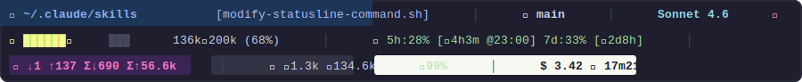

<div align="center">

# ⬡ Claude Code Statusline

**A rich, 3-line ANSI terminal status bar for [Claude Code](https://claude.ai/code)**

[](LICENSE)
[](https://www.gnu.org/software/bash/)
[-informational)](#platform-support)
[](https://jqlang.github.io/jq/)

Surface session data — context usage, model info, git state, token counts, cache efficiency, cost, and rate limits — updated on every AI turn.

</div>

---

## Preview



> Colors are rendered live in the terminal using ANSI escape codes. The preview above approximates the actual appearance.

---

## Features

- **3 information-dense lines** with no wasted space
- **Live context bar** with smooth Unicode eighth-block fill (▏▎▍▌▋▊▉█) and threshold-based color (green → yellow → red → alarm)
- **Git integration** — branch name, staged, modified, and untracked file counts
- **Model badges** — thinking mode 💡, fast mode ⚡, effort level, vim mode
- **Rate limit tracking** — 5h and 7d usage with countdown and local reset time
- **Cache efficiency** — real-time ratio of cache reads vs total cache activity
- **Cost + duration** — cumulative session cost, API time, and wall-clock time
- **Cross-platform** — Linux, macOS (bash 3.2+), Windows via Git Bash
- **Zero external calls** — all data comes from the JSON payload Claude Code pipes via stdin

---

## What Each Line Shows

### Line 1 — Location · Git · Model

```
❯ ~/.claude/skills [modify-statusline-command.sh] │ ⎇ main │ Sonnet 4.6 💡 𐄛 │
```

| Element | Meaning |
|---------|---------|
| `❯ ~/path` | Working directory (`~` substituted for `$HOME`) |
| `[session-name]` | Named session, if set via `/rename` |
| `+N` | Number of extra workspace directories added |
| `↑project` | VS Code project root when it differs from `cwd` |
| `⎇ branch` | Git branch name (or `HEAD` if detached) |
| `+N` (green) | Staged file count |
| `~N` (yellow) | Modified unstaged file count |
| `?N` (dim) | Untracked file count |
| `⎇ —` (dim) | Not a git repository |
| Model name | Color-coded: gold = Opus, green = Haiku, cyan = Sonnet |
| `💡` | Extended thinking enabled |
| `⚡` | Fast mode enabled |
| `𐄙`–`𐄝` | Effort level: low → medium → high → xhigh → max |
| `N/I/V/VL` | Vim mode: Normal / Insert / Visual / Visual Line |

### Line 2 — Context Bar · Rate Limits

```
⛁ ██████▊███ 136k╱200k (68%) │ ◷ 5h:28% [↻4h3m @23:00] 7d:33% [↻2d8h] │
```

| Element | Meaning |
|---------|---------|
| `⛀` (green) | Context < 65% — healthy |
| `⛁` (yellow) | Context 65–74% — warning |
| `⛁` (red) | Context 75–79% — danger |
| `⚠` (red bg) | Context ≥ 80% — autocompact imminent |
| `⛔ OVERFLOW` | Exceeds 200k token limit |
| `136k╱200k (68%)` | Used tokens / window size / percentage |
| `◷ 5h:28%` | 5-hour rolling rate limit usage |
| `[↻4h3m @23:00]` | Time until reset + local clock time |
| `7d:33% [↻2d8h]` | 7-day rate limit usage and countdown |
| Rate limit colors | Green < 70% · yellow bg ≥ 70% · red bg ≥ 90% |

> **Autocompact note:** Claude Code reserves a ~33k token buffer (16.5% of 200k). Autocompact fires at approximately 83.5% usage, which is why ≥ 80% is treated as the critical threshold.

### Line 3 — Tokens · Cache · Cost

```
⬡ ↓1 ↑137 Σ↓690 Σ↑56.6k │ ⚡ ⊕1.3k ↻134.6k ♻99% │ $ 3.42 ⧗ 17m21s╱20h5m ∆ +632 -131 │
```

| Element | Meaning |
|---------|---------|
| `⬡` section | Token counts (magenta background) |
| `↓N` / `↑N` | Current-turn input / output tokens |
| `Σ↓N` / `Σ↑N` | Session total input / output tokens |
| `⚡` section | Cache activity (dark gray background) |
| `⊕N` | Cache write tokens (created this turn) |
| `↻N` | Cache read tokens (served from cache) |
| `♻N%` | Cache efficiency: reads ÷ total × 100 (green ≥ 70%, yellow 40–69%, red < 40%) |
| Cost section | White background, black text |
| `$ N.NN` | Cumulative session cost in USD |
| `⧗ api╱wall` | API processing time / total wall-clock time |
| `∆ +N -N` | Lines added and removed this session |

---

## Installation

### Via Claude Code Skill (Recommended)

Copy the `setup-statusline` folder into your Claude Code skills directory:

```bash
# Clone or copy the skill
cp -r setup-statusline ~/.claude/skills/

# Then in any Claude Code session, run:
/setup-statusline
```

Claude will detect your OS, verify prerequisites, deploy the script, and configure `~/.claude/settings.json` automatically.

### Manual Installation

**1. Copy the script**

```bash
cp assets/statusline-command.sh ~/.claude/statusline-command.sh
chmod +x ~/.claude/statusline-command.sh
```

**2. Add to `~/.claude/settings.json`**

```json
{
  "statusLine": {
    "type": "command",
    "command": "bash ~/.claude/statusline-command.sh",
    "refreshInterval": 10
  }
}
```

**3. Restart Claude Code** — the statusline appears immediately on the next session.

---

## Prerequisites

| Tool | Purpose | Install |
|------|---------|---------|
| `bash` 3.2+ | Script runtime | Pre-installed on macOS/Linux |
| `jq` | JSON parsing | `brew install jq` / `apt install jq` |
| `git` | Branch & status info | `brew install git` / `apt install git` |
| `awk` | Arithmetic & formatting | Pre-installed on all platforms |

---

## Platform Support

| Platform | Status | Notes |
|----------|--------|-------|
| Linux (any distro) | ✅ Full support | Uses `date -d @epoch` |
| macOS | ✅ Full support | Uses `date -r epoch`; bash 3.2 compatible (no `mapfile`) |
| WSL (Windows) | ✅ Full support | Behaves as Linux |
| Git Bash (Windows) | ✅ Full support | Requires `jq` added to PATH manually; needs Windows Terminal for ANSI colors |
| cmd.exe / PowerShell | ❌ Not supported | No bash runtime; ANSI codes not rendered |

---

## Configuration

The statusline is controlled by the `statusLine` key in `~/.claude/settings.json`:

```json
{
  "statusLine": {
    "type": "command",
    "command": "bash ~/.claude/statusline-command.sh",
    "refreshInterval": 10
  }
}
```

| Setting | Description |
|---------|-------------|
| `type` | Must be `"command"` for script-based statuslines |
| `command` | Shell command Claude Code executes on each refresh |
| `refreshInterval` | Seconds between refreshes (10 is recommended) |

---

## Debugging

The script writes the raw JSON payload it receives to `/tmp/statusline-debug.json` on every refresh. To manually test the script against the last payload:

```bash
cat /tmp/statusline-debug.json | bash ~/.claude/statusline-command.sh
```

---

## Customization

All visual elements — icons, colors, thresholds, and layout — are defined in `statusline-command.sh`. Key sections:

| Section | Location | What to change |
|---------|----------|----------------|
| Context thresholds | `# Context bar: fill color...` | Percentage breakpoints and colors |
| Model colors | `case "$model_raw"` | Add or change model color mappings |
| Effort icons | `case "$_effort"` | Replace Aegean numeral glyphs |
| Rate limit thresholds | `# Rate limits:` | Warning/critical percentages |
| Cache efficiency bands | `# Cache efficiency:` | Green/yellow/red breakpoints |

---

## How It Works

Claude Code executes the `command` from `settings.json` on every AI turn, piping a JSON payload via **stdin**. The script:

1. Reads the JSON payload with `cat` (stdin)
2. Extracts all 29 fields in a single `jq` invocation
3. Builds each display section independently
4. Assembles 3 lines of ANSI-escaped text
5. Outputs via `printf "%b"` which interprets the `\033` escape sequences as terminal colors

The payload contains everything needed — no network calls, no file reads beyond the script itself.

---

## License

[MIT](LICENSE) © 2026 Paul Millner
