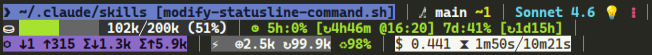
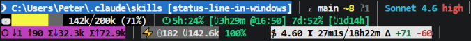

<div align="center">

# ⬡ Claude Code Statusline

**A rich, 3-line ANSI terminal status bar for [Claude Code](https://claude.ai/code)**

[](LICENSE)
[](https://www.gnu.org/software/bash/)
[](https://learn.microsoft.com/en-us/powershell/)
[](#platform-support)
[](https://jqlang.github.io/jq/)

Surface session data — context usage, model info, git state, token counts, cache efficiency, cost, and rate limits — updated on every AI turn.

</div>

---

## Preview

### Linux / macOS / WSL / Git Bash



### Windows (PowerShell / CMD)



> Colors are rendered live in the terminal using ANSI escape codes. The previews above approximate the actual appearance.

---

## Features

- **3 information-dense lines** with no wasted space
- **Live context bar** with smooth Unicode eighth-block fill (▏▎▍▌▋▊▉█) and threshold-based color (green → yellow → red → alarm)
- **Git integration** — branch name, staged, modified, and untracked file counts
- **Model badges** — thinking mode 💡, fast mode ⚡, effort level, vim mode
- **Rate limit tracking** — 5h and 7d usage with countdown and local reset time
- **Cache efficiency** — real-time ratio of cache reads vs total cache activity
- **Cost + duration** — cumulative session cost, API time, and wall-clock time
- **Per-platform assets** — each OS gets a dedicated, clean script with no cross-platform branching
- **Windows native** — PowerShell version uses `ConvertFrom-Json`; no `jq` required on Windows

---

## What Each Line Shows

### Line 1 — Location · Git · Model

```
❯ ~/.claude/skills [modify-statusline-command.sh] │ ⎇  main │ Sonnet 4.6 💡 high │
```

| Element | Meaning |
|---------|---------|
| `❯ ~/path` | Working directory (`~` substituted for `$HOME` / `$USERPROFILE`) |
| `[session-name]` | Named session, if set via `/rename` |
| `+N` | Number of extra workspace directories added |
| `↑project` | VS Code project root when it differs from `cwd` |
| `⎇  branch` | Git branch name (or `HEAD` if detached) |
| `+N` (green) | Staged file count |
| `~N` (yellow) | Modified unstaged file count |
| `?N` (dim) | Untracked file count |
| `⎇  —` (dim) | Not a git repository |
| Model name | Color-coded: gold = Opus, green = Haiku, cyan = Sonnet |
| `💡` | Extended thinking enabled |
| `⚡` | Fast mode enabled |
| `low`/`medium`/`high`/`xhigh`/`max` | Effort level (colored text: dim→yellow→red→red→white-on-red) |
| `N/I/V/VL` | Vim mode: Normal / Insert / Visual / Visual Line |

### Line 2 — Context Bar · Rate Limits

```
⛁ ██████▊███ 136k╱200k (68%) │ ◷ 5h:28% [↻4h3m @23:00] 7d:33% [↻2d8h] │
```

| Element | Meaning |
|---------|---------|
| `⛀` (green) | Context < 65% — healthy |
| `⛁` (yellow) | Context 65–74% — warning |
| `⛁` (red) | Context 75–79% — danger |
| `⚠` (red bg) | Context ≥ 80% — autocompact imminent |
| `⛔ OVERFLOW` | Exceeds 200k token limit |
| `136k╱200k (68%)` | Used tokens / window size / percentage |
| `◷ 5h:28%` | 5-hour rolling rate limit usage |
| `[↻4h3m @23:00]` | Time until reset + local clock time (24h) |
| `7d:33% [↻2d8h]` | 7-day rate limit usage and countdown |
| Rate limit colors | Green < 70% · black-on-yellow ≥ 70% · white-on-red ≥ 90% |

> **Autocompact note:** Claude Code reserves a ~33k token buffer (16.5% of 200k). Autocompact fires at approximately 83.5% usage, which is why ≥ 80% is treated as the critical threshold.

### Line 3 — Tokens · Cache · Cost

```
⬡ ↓1 ↑137 Σ↓690 Σ↑56.6k │ ⚡ ⊕1.3k ↻134.6k 99% │ $ 3.42 ⧗ 17m21s╱20h5m ∆ +632 -131 │
```

| Element | Meaning |
|---------|---------|
| `⬡` section | Token counts (magenta background) |
| `↓N` / `↑N` | Current-turn input / output tokens |
| `Σ↓N` / `Σ↑N` | Session total input / output tokens |
| `⚡` section | Cache activity (dark gray background) |
| `⊕N` | Cache write tokens (created this turn) |
| `↻N` | Cache read tokens (served from cache) |
| `N%` | Cache efficiency: reads ÷ total × 100 (green ≥ 70%, yellow 40–69%, red < 40%) |
| Cost section | White background, black text |
| `$ N.NN` | Cumulative session cost in USD |
| `⧗ api╱wall` | API processing time / total wall-clock time |
| `∆ +N` | Lines added this session (dark green) |
| `-N` | Lines removed this session (dark red) |

---

## Platform Support

Each platform has a dedicated script with no cross-platform branching:

| Platform | Asset | Shell / Runtime | JSON parser | Notes |
|----------|-------|-----------------|-------------|-------|
| Linux | `assets/linux/` | bash + `mapfile` | `jq` | Native Linux |
| macOS | `assets/macos/` | bash 3.2+ (while-loop) | `jq` | BSD `date -r epoch` |
| WSL | `assets/wsl/` | bash + `mapfile` | `jq` | Identical to Linux |
| Git Bash | `assets/gitbash/` | bash (while-loop) | `jq` | GNU `date -d @epoch`; needs Windows Terminal for ANSI |
| PowerShell | `assets/windows-ps/` | PowerShell 5.1+ | `ConvertFrom-Json` | No `jq` needed; supports PS 7 (pwsh) |
| CMD | `assets/windows-cmd/` | `.bat` launcher | — | Delegates to `statusline.ps1`; both files required |

**ANSI color support on Windows:** requires Windows Terminal, VS Code terminal, or Windows 10 v1511+ with VT100 processing enabled. Plain `cmd.exe` windows on older Windows versions will display raw escape sequences.

---

## Installation

### Via Claude Code Skill (Recommended)

Copy the `setup-statusline` folder into your Claude Code skills directory, then run the skill:

```bash
cp -r setup-statusline ~/.claude/skills/
# In any Claude Code session:
/setup-statusline
```

Claude will detect your OS, verify prerequisites, deploy the correct script, and configure `~/.claude/settings.json` automatically.

### Manual Installation

#### Linux / macOS / WSL / Git Bash

**1. Copy the platform script**

```bash
# Replace <platform> with: linux, macos, wsl, or gitbash
cp assets/<platform>/statusline-command.sh ~/.claude/statusline-command.sh
chmod +x ~/.claude/statusline-command.sh
```

**2. Add to `~/.claude/settings.json`**

```json
{
  "statusLine": {
    "type": "command",
    "command": "bash ~/.claude/statusline-command.sh",
    "refreshInterval": 10
  }
}
```

#### PowerShell (Windows)

**1. Copy the script**

```powershell
Copy-Item "assets\windows-ps\statusline.ps1" "$env:USERPROFILE\.claude\statusline.ps1"
```

**2. Add to `%USERPROFILE%\.claude\settings.json`**

```json
{
  "statusLine": {
    "type": "command",
    "command": "pwsh -NoProfile -NonInteractive -ExecutionPolicy Bypass -File \"%USERPROFILE%\\.claude\\statusline.ps1\"",
    "refreshInterval": 10
  }
}
```

> Use `powershell` instead of `pwsh` if you are on PowerShell 5.1 (Windows built-in) without PowerShell 7 installed.

#### CMD (Windows)

CMD cannot process JSON or render rich output on its own. The batch file is a thin launcher that delegates to `statusline.ps1` — both files must be deployed together.

**1. Copy both files**

```batch
copy assets\windows-ps\statusline.ps1 "%USERPROFILE%\.claude\statusline.ps1"
copy assets\windows-cmd\statusline.bat "%USERPROFILE%\.claude\statusline.bat"
```

**2. Add to `%USERPROFILE%\.claude\settings.json`**

```json
{
  "statusLine": {
    "type": "command",
    "command": "\"%USERPROFILE%\\.claude\\statusline.bat\"",
    "refreshInterval": 10
  }
}
```

**3. Restart Claude Code** — the statusline appears immediately on the next session.

---

## Prerequisites

### Bash variants (Linux / macOS / WSL / Git Bash)

| Tool | Purpose | Install |
|------|---------|---------|
| `bash` 3.2+ | Script runtime | Pre-installed on macOS/Linux |
| `jq` | JSON parsing | `brew install jq` / `apt install jq` |
| `git` | Branch & status info | `brew install git` / `apt install git` |
| `awk` | Arithmetic & formatting | Pre-installed on all platforms |

### Windows (PowerShell / CMD)

| Tool | Purpose | Install |
|------|---------|---------|
| PowerShell 5.1+ | Script runtime | Pre-installed on Windows 10+ |
| `git` | Branch & status info | `winget install Git.Git` |

No `jq` required — the PowerShell script uses `ConvertFrom-Json` natively.

---

## Configuration

The statusline is controlled by the `statusLine` key in `~/.claude/settings.json` (or `%USERPROFILE%\.claude\settings.json` on Windows):

| Setting | Description |
|---------|-------------|
| `type` | Must be `"command"` for script-based statuslines |
| `command` | Shell command Claude Code executes on each refresh |
| `refreshInterval` | Seconds between refreshes (10 is recommended) |

---

## Debugging

**Bash variants:** the script writes the raw JSON payload to `/tmp/statusline-debug.json` on every refresh:

```bash
cat /tmp/statusline-debug.json | bash ~/.claude/statusline-command.sh
```

**PowerShell / CMD:** the debug snapshot is written to `$env:TEMP\statusline-debug.json`:

```powershell
Get-Content "$env:TEMP\statusline-debug.json" | & pwsh -NoProfile -ExecutionPolicy Bypass -File "$env:USERPROFILE\.claude\statusline.ps1"
```

---

## Customization

All visual elements — icons, colors, thresholds, and layout — are defined within each platform's script. Key sections are consistent across all variants:

| Section | What to change |
|---------|----------------|
| Context thresholds | Percentage breakpoints and colors near `# Context bar` |
| Model colors | `case "$model_raw"` (bash) / `switch ($modelId)` (PS) |
| Effort labels | `case "$_effort"` (bash) / `switch ($effort)` (PS) |
| Rate limit thresholds | Warning/critical percentages near `# Rate limits` |
| Cache efficiency bands | Green/yellow/red breakpoints near `# Cache efficiency` |

---

## How It Works

Claude Code executes the `command` from `settings.json` on every AI turn, piping a JSON payload via **stdin**. The script:

1. Reads the JSON payload (stdin)
2. Extracts all required fields in a single pass (`jq` on bash; `ConvertFrom-Json` on PowerShell)
3. Builds each display section independently
4. Assembles 3 lines of ANSI-escaped text
5. Outputs to stdout

The payload contains everything needed — no network calls, no file reads beyond the script itself.

---

## License

[MIT](LICENSE) — free to use, modify, and distribute.
